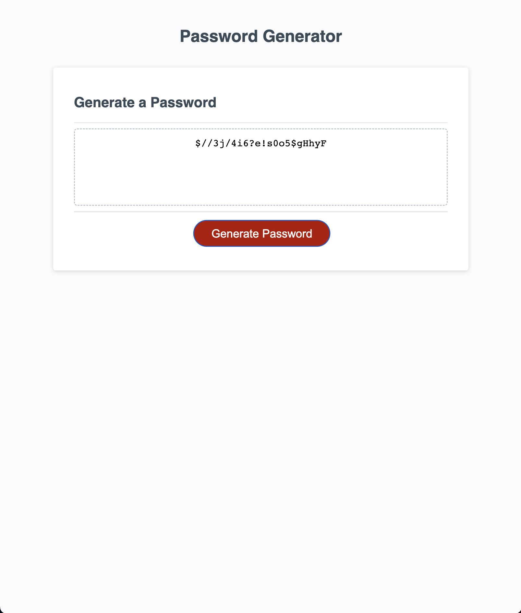

# Password-generator

## A tool to generate randomised passwords for a user.

This project can be used as a tool to generate a random password for the user, using a series of confirm windows and a button. The generator requires:

- Specification of number of characters (10-64).
- Specification of what kind of characters to use (special, numeric, uppercase and lowercase).

The end result (a randomised password generated within above mentioned parameters) is then created by the click of a button.

 

## Installation

N/A

## Usage

Wesbite link:

To run the code, visit the link above, and follow the prompt instructions. Then, finally, click the 'Generate Password' button.

## Credits

- Math.min and Math.max - mdn web docs\_ - https://developer.mozilla.org/en-US/docs/Web/JavaScript/Reference/Global_Objects/Math/min

## License

Please refer to the licence in the repo.
